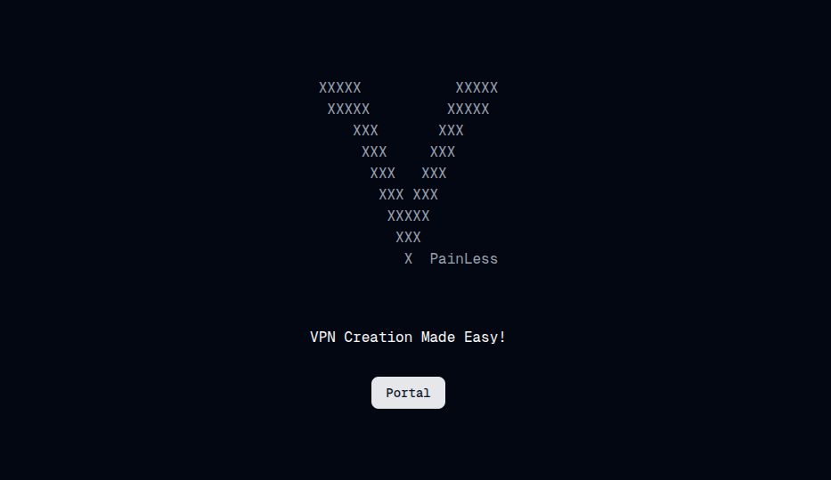

# VPainLess

VPainLess is a framework designed to create VLESS VPNs without any barriers.

## Motivations

I'm from a country with strict internet censorship where accessing the internet often requires specialized VPNs such as the [Xray](https://github.com/XTLS/Xray-core) project. To assist my family and friends, I have to frequently set up VPNs for them. Recently however, as censorship has increased, my servers frequently become blacklisted, requiring me to establish new VPNs almost daily on different hosts, which is quite burdensome. Whenever a server is blocked, friends must contact me, then wait while I find the time to set up a new VPN, leaving them temporarily without internet access.

This scenario motivated me to create VPainLess, a solution to automate the VPN setup process, allowing my family and friends to independently renew or create VPNs with a single click, thus eliminating the need to contact me directly. VPainLess allows me to assign dedicated accounts to my friends, enabling them to manage their VPN access without ever needing to reach out to me.

There are numerous one-click installation scripts and tools available for creating Xray VPNs, but they are primarily designed for developers. These tools often require setting up an account with a VPS provider and configuring servers, which can be a daunting task for someone without technical expertise. Additionally, many people either lack access to host providers outside their country or are unable to afford the cost of servers. VPainLess simplifies this process, reducing it to merely clicking a single button, tailored specifically for end users, not administrators.

## Getting Started

### Installation

For developers, I trust you have the skills to deploy and run this project in your preferred manner. For those without coding experience, please refer to our [Zero Code Installation Guide](./docs/guides/zero-code-installation.md).

### Setting up accounts

After installation, refer to [Setting Up Accounts](./docs/guides/setting-up.md) guide for the initial setup.

## How does Vpainless work?
