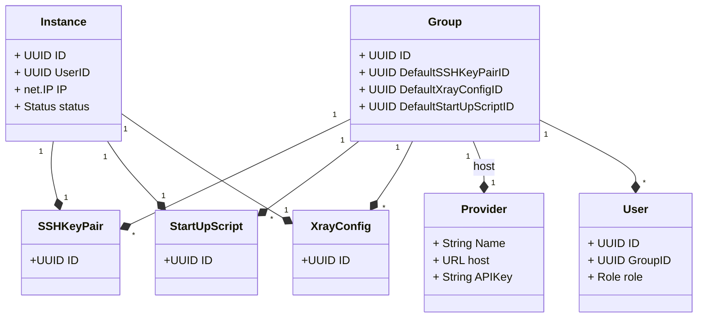
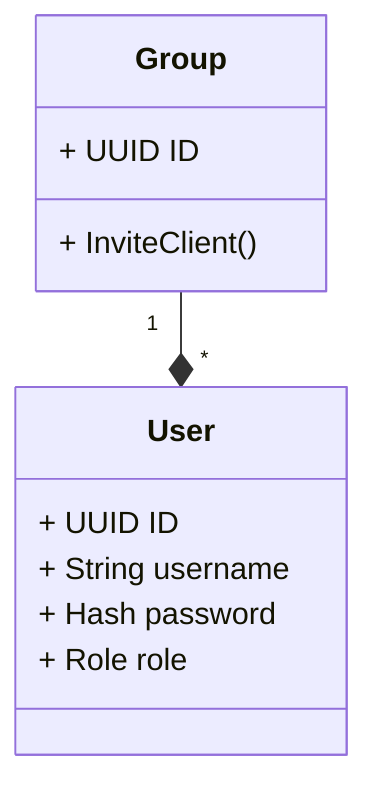

# EDD 00002: Domain Driven Design - Part 2

## Context

This document is an exploration of requirement and features. A continuation form previous [EDD](./00001-DDD-part-1.md). It's objective is to shape an initial draft of potential bounded contexts, subdomains and ubiquitous language.

## Ubiquitous Language

- **User**: Anyone that registers in our application, using a username and password.
- **Group**: Any user that's not part of any group can create a group, they'll become the admin of the group.
- **Admin**: The use that has created the group, of has been promoted by another group admin.
- **Client**: Any user made by an admin group. Clients will be associated to a group from the beginning.
- **Xray**: A VPN server providing multiple protocols to bypass censorship: [GitHub Link](https://github.com/XTLS/Xray-core)
- **VPN**: Is an application based on Xray, running on an instance to help clients bypass the censorship.
- **Provider** : Is the platform that provides VPS services, for now we only support Vultr.
- **Instance**: Is a VM running on a hosting platform.
- **SSH-Key-Pair**: Is a key pair to access instances. Public-Key will be used to setup instance and ssh key will be used to connect to them and configure them.

### Requirements and Business Invariants

- Clients have to authenticate to the system using basic Auth before being able to interact with the system.
- Besides a username and password, no other data is collected from clients.
- Clients can create a VPN after logging into the system.
- Each client is limited to only one VPN at a time. After logging in, they will see the VPN connection string if they have made one.
- Clients can renew their VPN anytime they wish. Renewing VPNs means deleting the instance and creating a new one.
- Each VPN runs on a single Instance.
- VPNs are not shared among users.

- For each group, we should store a Default SSH key-pair. This key pair will be used to setup the instance
- SSH public key should be stored in the host, but the private key should be stored in the DB

- Admins can upload multiple startup scripts.
- Scripts should be stored in both Host and DB.
- Admins should mark a startup script as default, this will be the scripts that is used to configure instances.

- Admins can upload multiple xray configs.
- Scripts should be stored in DB and uploaded to the instance when initialization is done.
- Admins should mark a xray config as default, this will be the scripts that is used to configure instances.

### Aggregates, Entities and Value Objects

```mermaid
graph TB
    subgraph Access Domain
        direction TB
        subgraph User aggregate
            AUser(User) --has--> ARole(Role)
        end
        subgraph Group aggregate
            AGroup(Group) --has multiple--> AUser
        end
        class AGroup entity
        class AUser entity
        class ARole value
    end

    subgraph Hosting Domain
        subgraph group aggregate
            HGroup(Group) --has multiple--> G1(StartUpScript)
            HGroup --has multiple--> G2(SSHKeyPair)
            HGroup --has maultiple--> G3(XrayConfig)
            HGroup --has a--> G4(Provider)
            HUser(User) --has--> HRole(Role)
            HGroup --has multiple--> HUser

            class HGroup entity
            class HUser entity
            class HRole value
            class G1 value
            class G2 value
            class G3 value
            class G4 value
        end
        subgraph instance aggregate
            HUser --has a--> Instance
            Instance --has a--> I1(StartUpScript)
            Instance --has a--> I2(XrayConfig)
            Instance --has a--> I3(SSHKeyPair)

            class Instance entity
            class I1 value
            class I2 value
            class I3 value
        end
    end

    ValueObj(Value Object)
    Entity(Entity)

    classDef value fill:#555555,stroke-width:1px;
    classDef entity fill:#222222,stroke-width:5px;

    class ValueObj value
    class Entity entity
```

Class diagram for aggregates in the Hosting domain:

- SSHkeyPair, StartUpScript and XrayConfig are value objects.

Class diagram for aggregates in the access domain:

