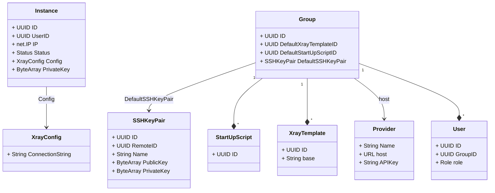
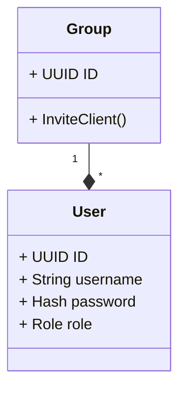

# EDD 00003: Domain Driven Design - Part 3: Hosting models

## Context

This document is an exploration of requirement and features. A continuation form previous [EDD](./00001-DDD-part-2.md). It's objective is to:

1. design a templating system for creating of xray configs.
2. design ssh key pair entity and aggregates.

## Ubiquitous Language

- **XrayConfig** is the final configuration file uploaded to the instance. It is ready to be consumed by xray.
- **XrayTemplate** is a base template for creating XrayConfigs. It has some template items inside which should be filled by the system when creating configs of this template.

### Requirements and Business Invariants

- Each group has a single ssh key pair and a single start up script
- Admins can set the default ssh key pair and start up script
- Admins can upload multiple xray templates.
- Admins should mark an xray template as default, this will be the template that is used to configure xray with.
- For newly created groups, system will:
  1. create a new default template. Admins can change the default later.
  1. create a new default ssh key pair. Admins can change the default later.
  1. create a new default start up script. Admins can change the default later.

### Aggregates, Entities and Value Objects

#### Entities:

- SSHKeyPair and StartUpScript: they have a life-cycle. If they are uploaded to the provider of the group or not?. Therefore, they should be an entity. Their state is tracked by the existence of their remote id.

```mermaid
graph TB
    subgraph Access Domain
        direction TB
        subgraph User aggregate
            AUser(User) --has--> ARole(Role)
        end
        subgraph Group aggregate
            AGroup(Group) --has multiple--> AUser
        end
        class AGroup entity
        class AUser entity
        class ARole value
    end

    subgraph Hosting Domain
        subgraph group aggregate
            HGroup(Group) --has a default--> G1(StartUpScript)
            HGroup --has a default--> G2(SSHKeyPair)
            HGroup --has a--> G4(Provider)
            HUser(User) --has--> HRole(Role)
            HGroup --has multiple--> XrayTemplate
            HGroup --has multiple--> HUser

            class XrayTemplate entity
            class HGroup entity
            class HUser entity
            class HRole value
            class G1 entity
            class G2 entity
            class G4 value
        end
        subgraph instance aggregate
            HUser --has a--> Instance
            Instance --has a--> XrayConfig
            class Instance entity
            class XrayConfig value
        end

    end

    ValueObj(Value Object)
    Entity(Entity)

    classDef value fill:#555555,stroke-width:1px;
    classDef entity fill:#222222,stroke-width:5px;

    class ValueObj value
    class Entity entity
```

Class diagram for aggregates in the Hosting domain:

Class diagram for aggregates in the access domain:

