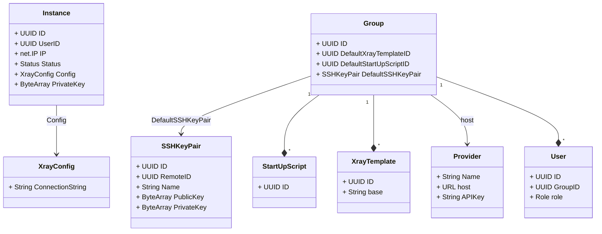
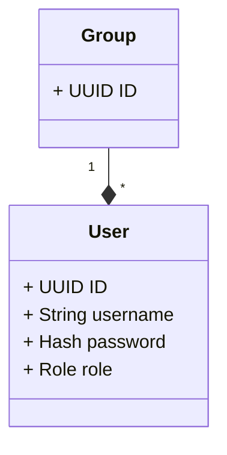

# VPainLess Architecture

## Tech Stack

| Name                                                  | Side                 | Used For          |
| ----------------------------------------------------- | -------------------- | ----------------- |
| [Type Script](https://www.typescriptlang.org/)        | Front-End            | Main Language     |
| [React](https://react.dev/)                           | Front-End            | UI Framework      |
| [Next JS](https://nextjs.org/)                        | Front-End            | Routing           |
| [OpenAPI 3](https://swagger.io/)                      | Front-End & Back-End | API Prototyping   |
| [Golang](https://go.dev/)                             | Back-End             | Main Language     |
| [Sqlite](https://sqlite.org/)                         | Back-End             | Storage           |
| [Open Policy Agent](https://www.openpolicyagent.org/) | Back-End             | Access Management |

## Design

### Architecture

VPainLess is structured as a modular monolith, consisting of two key modules: `hosting` and `access`. We have incorporated principles of Hexagonal architecture, where each module features a central core surrounded by various adapters. Presently, the `access` module is able to interact with the `hosting` module through a specially designed adapter, which is a typical practice in modular monoliths. While it is generally advisable to minimize synchronous calls between modules, the decision was made not to adopt an Event Driven Design due to the project's current small scale. This approach may be revisited as the project expands.

### Models

We have followed Domain Driven Design principles in designing this application. There are two main domains, `access`, and `hosting`. The entities and aggregates in each domain are displayed below.

```mermaid
graph TB
    subgraph Access Domain
        direction TB
        subgraph User aggregate
            AUser(User) --has--> ARole(Role)
        end
        subgraph Group aggregate
            AGroup(Group) --has multiple--> AUser
        end
        class AGroup entity
        class AUser entity
        class ARole value
    end

    subgraph Hosting Domain
        subgraph group aggregate
            HGroup(Group) --has a default--> G1(StartUpScript)
            HGroup --has a default--> G2(SSHKeyPair)
            HGroup --has a--> G4(Provider)
            HUser(User) --has--> HRole(Role)
            HGroup --has multiple--> XrayTemplate
            HGroup --has multiple--> HUser

            class XrayTemplate entity
            class HGroup entity
            class HUser entity
            class HRole value
            class G1 entity
            class G2 entity
            class G4 value
        end
        subgraph instance aggregate
            HUser --has a--> Instance
            Instance --has a--> XrayConfig
            class Instance entity
            class XrayConfig value
        end

    end

    ValueObj(Value Object)
    Entity(Entity)

    classDef value fill:#555555,stroke-width:1px;
    classDef entity fill:#222222,stroke-width:5px;

    class ValueObj value
    class Entity entity
```



Class diagram for aggregates in the Hosting domain:



Class diagram for aggregates in the access domain:



### Code Structure

The code is formatted in to a directory structure like

```
.
├── backend
│   ├── api -> API Spec and generated codes
│   ├── cmd -> Server entry point
│   ├── internal
│   │   ├── access -> access domain
│   │   ├── hosting -> hosting domain
│   │   └── pkg -> internal packages (can only contain public or external packages)
│   └── pkg -> public packages (can only contain external packages)
│       ├── collect
│       ├── middleware
│       ├── querybuilder
│       ├── remote
│       └── vultr
├── deployment -> Deployment files
├── docs -> Documentations
└── frontend -> Front-end code (react & next js directory structure)
```

### Access Control

Our access control is implemented using OPA (Open Policy Agent), following a model that resembles Role-Based Access Control (RBAC). At present, the system supports two user roles: _admin_ and _client_. These roles dictate permissions for performing various actions (_get_, _list_, _create_, _update_, _delete_) on several resource groups, such as _users_, _instances_, and _groups_ and, etc.

We use allow-based policies to control actions, meaning that actions are permitted, conditionally permitted, or denied, depending on the principal (the logged-in user) executing the action. Each policy defined in the Rego language comprises two components: `allow` and `condition`. The `condition` part corresponds to an SQL clause that is directly passed to the `storage` adapter to do the pre-filtration (as opposed to listing all resources and performing post filtration in the core).

This approach does create a direct dependency between the core and the storage adapter, which limits our ability to easily swap out SQLite for a different database. However, this trade-off offers several benefits, such as simplifying the overall implementation. Moreover, this dependency can be addressed in the future through abstraction or customization for another database system, so the advantages of this approach currently outweigh its drawbacks.

## Limitations

1. **Instance Allocation per User:** We allocate one instance per user, without sharing among users. While this decision increases costs when serving a large number of users in each group, it offers notable advantages: it simplifies implementation and reduces the frequency of VPNs and their hosts being blacklisted in censorious countries.

2. **Configuration Constraints:** Currently, there is no option to modify the reality configuration, startup script, or the SSH key used for instance configuration. The default settings for the reality configuration and the startup script are located [here](../../backend/internal/hosting/core/default/xray.json) and [here](../../backend/cmd/server/default/startup.sh), respectively.
