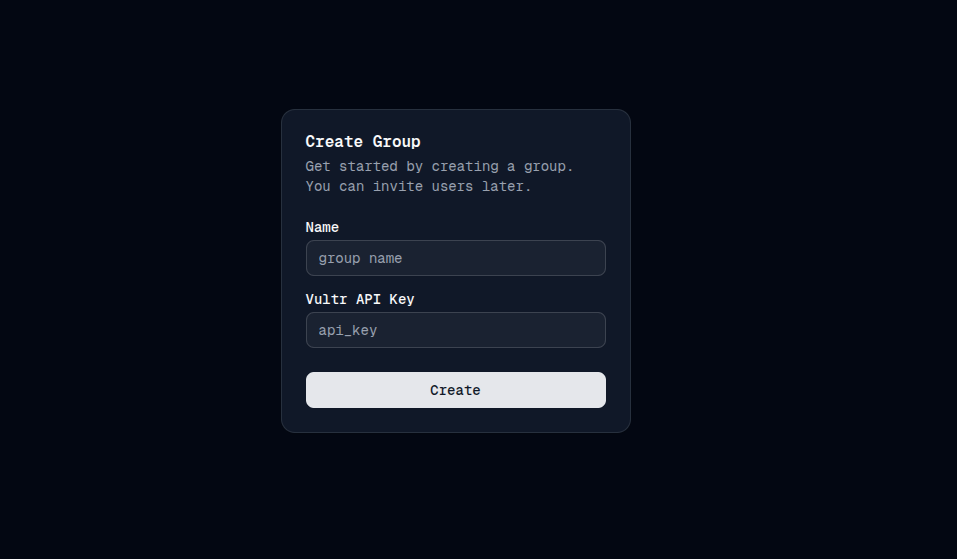

## Setting Up VPainLess

Getting your VPainLess account up and running is a straightforward process.

### Create a Vultr API Key

1. Log into your [Vultr](https://www.vultr.com/) account.
2. Navigate to `Account > API`.
3. Generate a new API key.
4. For access control, enter the IP address of your VPainLess instance. This should be in the format `your-instance-ip/32` (e.g., if your instance is deployed on `1.2.3.4`, use `1.2.3.4/32`).

### Configure VPainLess Groups and Accounts

1. Access your VPainLess deployment via your designated URL (e.g., `my-vpainless.duckdns.org`).
2. Begin the registration process:

   - Navigate to Portal > Register.
   - Select a unique username and create a strong password.
     

3. Upon registration, you’ll be prompted to set up a group:

   - Enter a name for your group.
   - Provide your Vultr API key.
     

4. Once the group is created, you'll be directed to the admin panel:
   
   - Here, you can create client accounts within the group.
   - Create usernames and passwords for each client you'd like to serve.
   - Share these credentials with your clients so they can log in to the VPainLess application.

Please note, any instances created are tied to the API key associated with your group, and you will be billed for these at month's end. You can manage clients and instances anytime through the admin panel.

With this setup, clients can independently log in and create their own VPNs using the VPainLess service.
