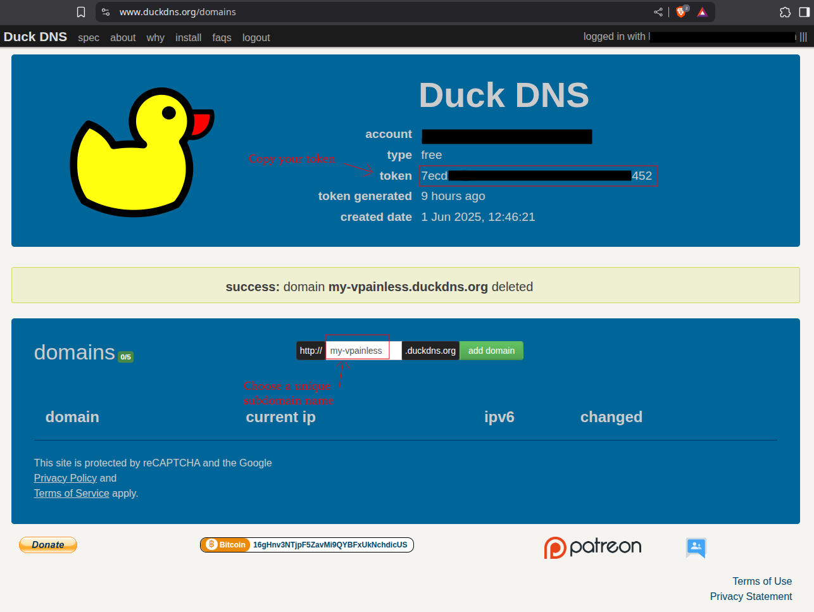
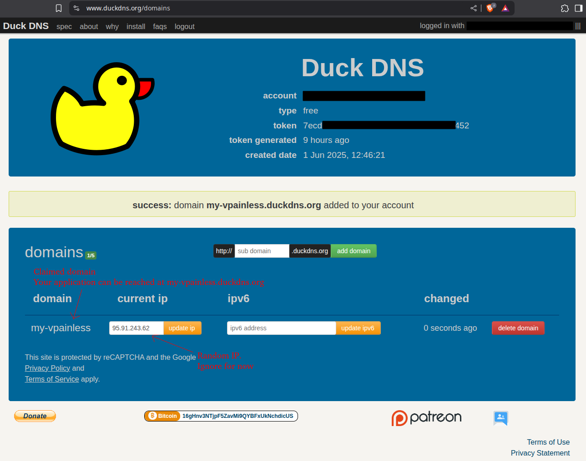
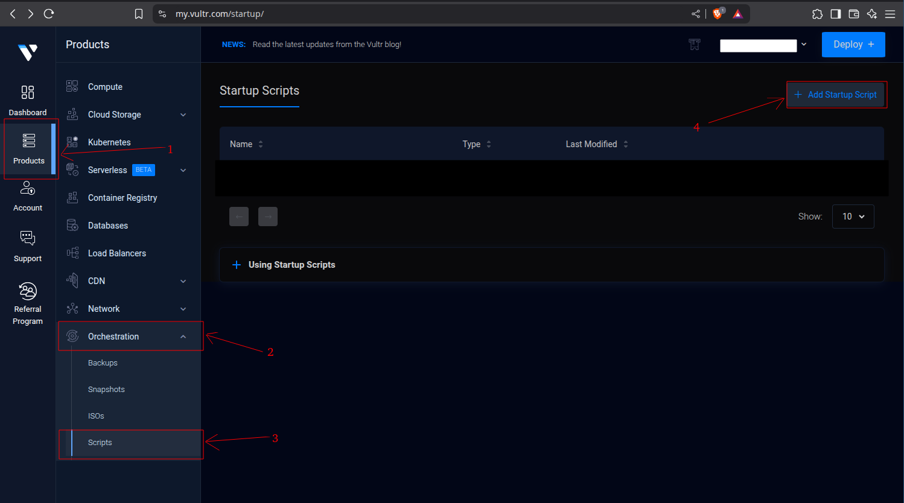
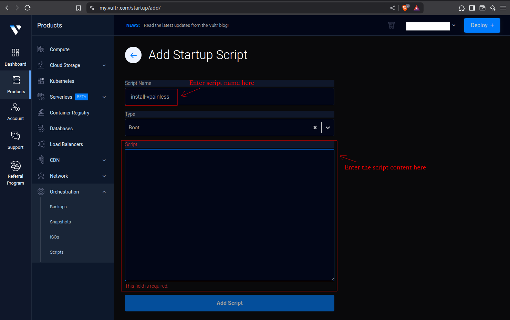
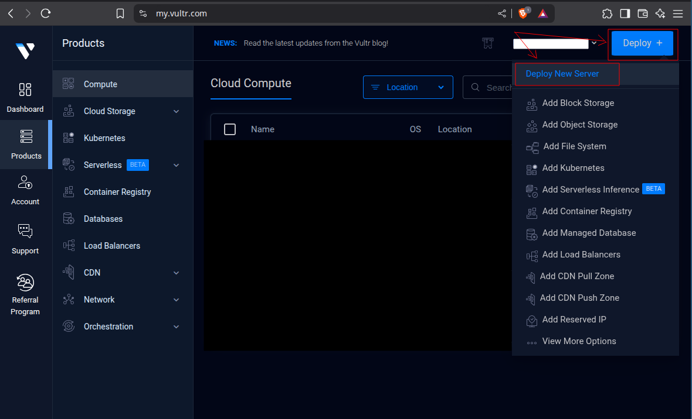
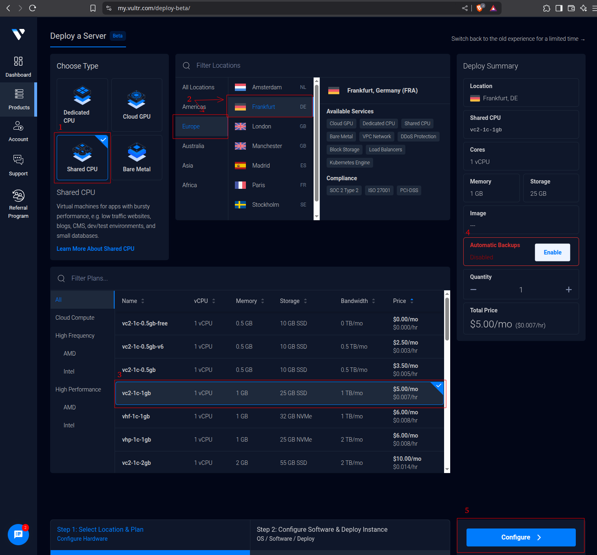
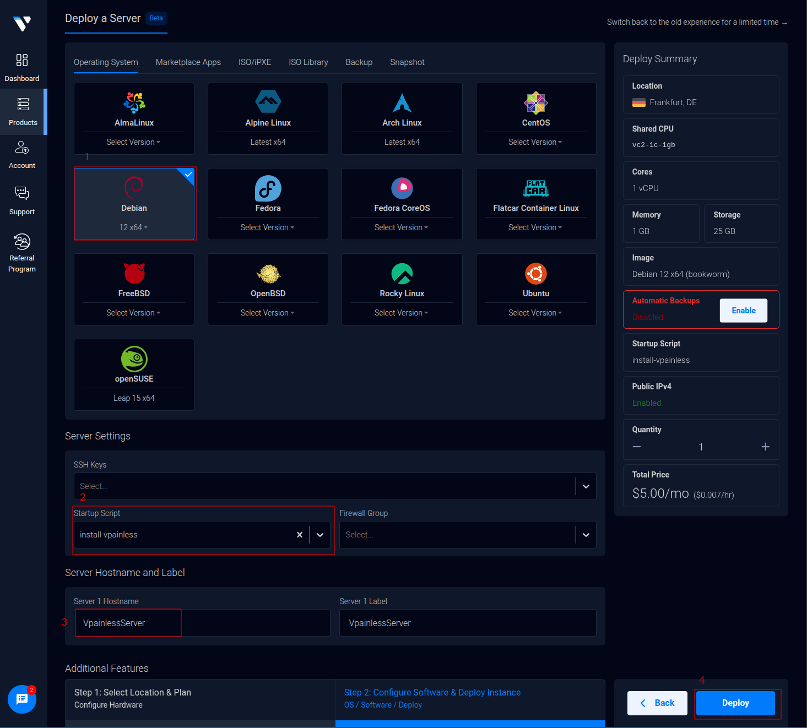

# Zero-Code Deployment Guide for VPainLess

This guide will walk you through setting up VPainLess on [Vultr](https://www.vultr.com/) using a free [DuckDNS](https://www.duckdns.org/) subdomain and a SSL certificate from [Let's Encrypt](https://letsencrypt.org/).

## Prerequisites

Ensure you have registered accounts on the following platforms:

- [Vultr](https://www.vultr.com/)
- [DuckDNS](https://www.duckdns.org/)

## Installation Steps

### Configure DuckDNS

1. Sign into your [DuckDNS](https://www.duckdns.org/) account.
2. Create a unique subdomain, for example `my-vpainless`. The subdomain needs to be unique, ensuring no one else has taken it.
3. Copy your DuckDNS Token as it will be needed later.
4. Click "Add Domain" after choosing your subdomain. If it's available, it's now yours.



After setting this up, your VPainLess server will be accessible at `your-subdomain.duckdns.org`. For instance, it would be `my-vpainless.duckdns.org`.



### Configure Host on Vultr

1. Log into [Vultr](https://www.vultr.com/).
2. Navigate to Products > Orchestration > Scripts.
   
3. Click "Add Startup Script". Name the script, e.g., `install-vpainless`. Ensure 'Type' is set to 'boot'.
   
4. Replace the places holders in the following script with the duckdns subdomain, and token, and create the script in vultr.

   ```bash
   #!/bin/bash

   export DUCKDNS_DOMAIN=<your-duckdns-subdomain>
   export DUCKDNS_TOKEN=<your-duckdns-token>

   curl -fsSL https://github.com/vpainless/vpainless/releases/download/v0.1.0-alpha/install.sh | bash 2>&1 | tee ~/install.log
   ```

   Examples: `DUCKDNS_DOMAIN=my-vpainless` and `DUCKDNS_TOKEN=00000000-0000-0000-0000-000000000000` (The one you copied before)

Next, deploy your server:

1. Go to Products > Compute and click the _Deploy +_ button, selecting _Deploy New Server_.
   

   - **Instance Recommendation:**
     - `Shared CPU`
     - Choose a region close to your intended users. (Example: Europe/Frankfurt)
     - Instance size `1vCPU` with `1GB RAM` (for example, `v2c-1c-1gb`)
     - Disable automatic backups to save costs.
       

2. Proceed to the configuration step:

   - Select `Debian 12 x64` as the operating system.
   - Choose the startup script (`install-vpainless`).
   - Set a hostname for your server.
   - Click "Deploy."
     

Once you initiate deployment, the setup process will take approximately 10 to 15 minutes.After completion, access VPainLess using the DuckDNS subdomain you configured. For further application-specific setup, refer to the [Setup Guide](./setting-up.md).

Now, sit back, relax, and perhaps get a :coffee: while your server gets ready!
